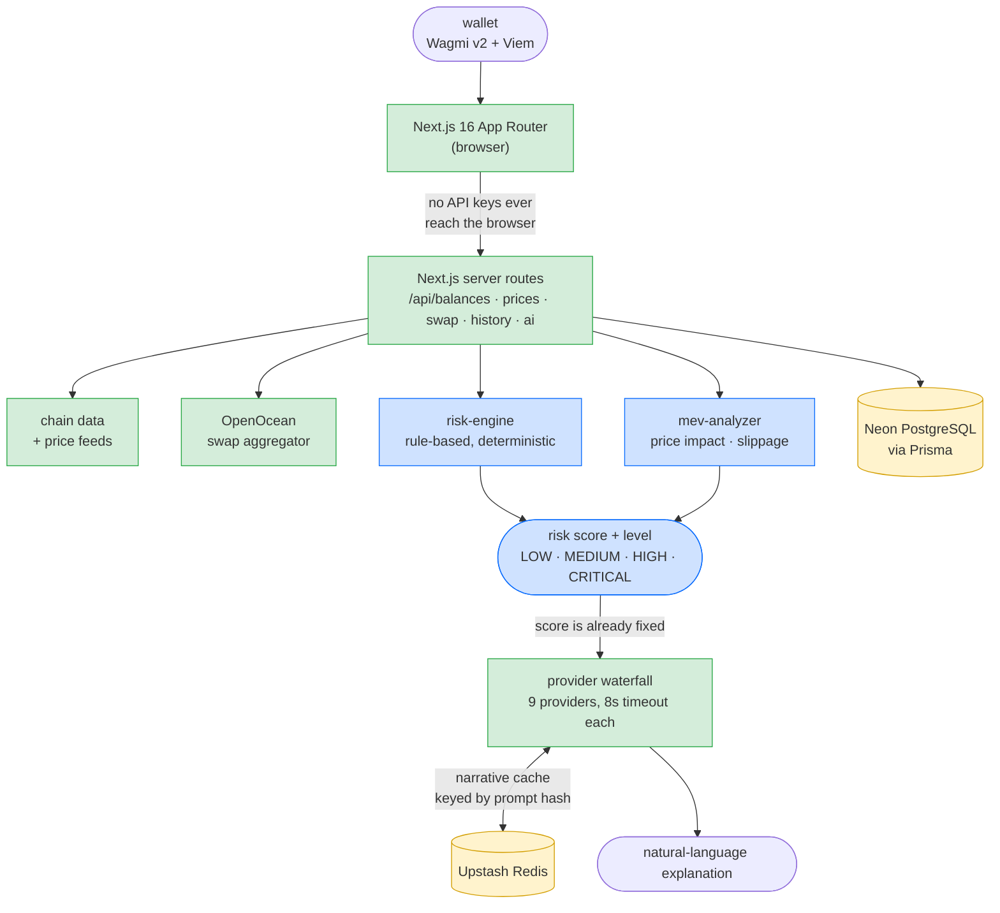

# VaultMind
### Intelligent DeFi Management

[]()
[]()
[]()
[](LICENSE)
[](https://github.com/VarunKarthikjakkamputi14072/vaultmind/actions/workflows/ci.yml)

**[Live Demo →](https://vaultmind-dun.vercel.app)**

---

## Overview

**An LLM that hallucinates a portfolio risk score is worse than no score at all —
VaultMind computes risk deterministically and lets the model write only the
explanation.**

A Web3 portfolio and treasury platform: monitor multi-chain holdings, execute
cross-chain swaps, and get risk assessments before trade execution — without
surrendering custody of private keys.

---

## Architecture



Blue is the deterministic path; the LLM sits downstream of a score it cannot
change. Full system design in [ARCHITECTURE.md](./ARCHITECTURE.md).

---

## The key design decision: the LLM never produces the risk score

**The alternative I rejected:** hand the portfolio to the model and ask it to
return a risk score with its reasoning. One call, no rules to maintain, and it
adapts to assets a rule engine has never seen.

**Why it loses:** a risk score is a number a user makes money decisions on, and
an LLM's number is unreproducible, unauditable, and confidently wrong at the
tails. The same portfolio can score 40 and 65 on consecutive calls with no
explanation. You can't unit-test it, can't diff it across a release, and when a
user asks "why is this HIGH?" the honest answer is "the model said so." It also
puts a network dependency and a provider outage directly in the path of a core
feature.

**What VaultMind does instead:** `evaluatePortfolioRisk()` is a pure function —
spam/illiquid token detection, stablecoin ratio, and diversification, each with a
fixed point contribution and a stated threshold. It returns the score, the level,
and the list of factors that produced it. The LLM is then handed a score it
**cannot change** and asked only to explain it in prose. Deterministic
correctness and probabilistic generation stay on opposite sides of a hard line.

**What it costs, honestly:** the thresholds are hand-tuned and coarse — an
8-symbol stablecoin allowlist and three rules will misjudge portfolios built from
assets it doesn't know (LP positions, staked derivatives, long-tail tokens). A
model would handle those more gracefully. The bet is that a wrong-but-inspectable
score you can fix in one commit beats a plausible one nobody can audit.

---

## Measured result

Measured **2026-08-05** on an Apple M2 (8 core / 16 GB), Node 25.6.

**The deterministic core is fast and reproducible** — 100,000 evaluations over
1,000 synthetic portfolios (1–9 assets each, spam and stablecoins mixed in):

| Metric | Result |
|---|---|
| Throughput | 100,000 evaluations in **17.7 ms** |
| Mean per evaluation | **0.18 µs** |
| Determinism | same portfolio × 1,000 → **byte-identical** output |
| Level spread | LOW 738 · MEDIUM 152 · HIGH 110 |

Reproducibility is the point of the measurement, not the speed: because scoring
is a pure function, "same portfolio → same score" is a property the test suite
can actually assert. No LLM-scored design can make that claim.

**The test suite runs with no network and no API key** — the AI SDK is mocked and
the cache fails open without Redis:

```
Test Files  9 passed (9)
     Tests  49 passed (49)
  Duration  2.22s
```

Covered: the risk engine, the MEV analyzer, the 9-provider waterfall (failover,
per-provider timeout, total exhaustion), the narrative cache, and the OpenOcean
quote/swap adapters.

**One honest caveat:** the level spread above is over *synthetic* portfolios
generated by the benchmark, so it characterises the scoring function's behaviour,
not real user holdings. The thresholds have not been validated against a labelled
set of real portfolios — that's the obvious next step.

---

## Run it in under 2 minutes

```bash
git clone https://github.com/VarunKarthikjakkamputi14072/vaultmind
cd vaultmind
npm install
cp .env.example .env.local     # every key is optional — see below
npx prisma migrate dev
npm run dev                    # http://localhost:3000
```

The **tests need no keys at all** — the fastest way to see the deterministic core
work is `npm test` (49 tests, ~2s, no network). For the running app, any single
inference key from the waterfall is enough; providers without a key are skipped,
and Redis is optional because the cache fails open.

Live deployment: **[vaultmind-dun.vercel.app](https://vaultmind-dun.vercel.app)**

---

## Other engineering decisions

- **Provider-agnostic inference waterfall**: a 9-provider cascade — Groq →
  Cerebras → Gemini Flash → Sambanova → Cohere → Together AI → Mistral →
  HuggingFace → OpenRouter — so narrative generation survives any single
  provider's outage or quota limit. Providers with no configured key are skipped,
  and each attempt gets an **8-second timeout** so a hung provider fails over fast
  instead of stalling the request. Every attempt is recorded in a provider trace.
- **Cached narratives**: insights are cached in Upstash Redis keyed by a hash of
  the prompt, so an identical portfolio or quote doesn't re-bill the LLM. Caching
  **fails open** — a Redis outage is a cache miss, never a failed request.
- **Secure middleware abstraction**: all external calls (swap aggregation,
  portfolio data, LLM inference) are proxied through Next.js server routes. Zero
  API keys are exposed to the browser.
- **12-point deployment gate**: `validate.sh` enforces TypeScript strictness,
  ESLint compliance, a production build, and Prisma schema integrity before every
  deployment.

---

## Stack
| Layer | Technology |
|---|---|
| Framework | Next.js 16 (App Router) + TypeScript |
| Web3 | Wagmi v2 + Viem |
| Inference | 9-provider waterfall (Groq · Cerebras · Gemini · Sambanova · Cohere · Together · Mistral · HuggingFace · OpenRouter) |
| Swap | OpenOcean aggregator |
| Database | Neon PostgreSQL + Prisma ORM |
| Cache / rate limiting | Upstash Redis (serverless) |
| Deploy | Vercel + Neon free tier |

---

## Tests & CI
The deterministic core (risk engine, MEV analyzer) and the AI plumbing (provider
fallback/timeout, narrative cache) are unit-tested with Vitest — no network or API key
needed, since the AI SDK is mocked and the cache fails open without Redis.

```bash
npm test          # vitest run
npx tsc --noEmit  # strict type check
npx eslint src    # lint
```

GitHub Actions (`.github/workflows/ci.yml`) runs the type check, lint, and tests on every
push and pull request. `validate.sh` still covers the full production build + Prisma gate
before a deploy.
